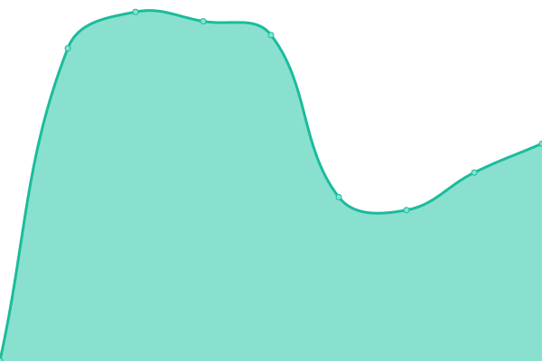

# [📈 Live Status](https://upptime.eseade.edu.ar): <!--live status--> **🟧 Partial outage**

This repository contains the open-source uptime monitor and status page for [Upptime](https://upptime.js.org), powered by [Upptime](https://github.com/upptime/upptime).

With [Upptime](https://upptime.js.org), you can get your own unlimited and free uptime monitor and status page, powered entirely by a GitHub repository. We use [Issues](https://github.com/upptime/upptime/issues) as incident reports, [Actions](https://github.com/smeseade/upptime/actions) as uptime monitors, and [Pages](https://upptime.eseade.edu.ar) for the status page.

<!--start: status pages-->
<!-- This summary is generated by Upptime (https://github.com/upptime/upptime) -->
<!-- Do not edit this manually, your changes will be overwritten -->
<!-- prettier-ignore -->
| URL | Status | History | Response Time | Uptime |
| --- | ------ | ------- | ------------- | ------ |
|  [Educat](http://educat.eseade.edu.ar) | 🟥 Down | [educat.yml](https://github.com/smeseade/upptime/commits/HEAD/history/educat.yml) | 

 939ms
     
 | 

<a href="https://upptime.eseade.edu.ar/history/educat">0.00%</a>
    

|  [Fusionauth](http://fa.eseade.edu.ar) | 🟩 Up | [fusionauth.yml](https://github.com/smeseade/upptime/commits/HEAD/history/fusionauth.yml) | 

 927ms
     
 | 

<a href="https://upptime.eseade.edu.ar/history/fusionauth">100.00%</a>
    

|  [Netdata](https://netdata.eseade.edu.ar) | 🟩 Up | [netdata.yml](https://github.com/smeseade/upptime/commits/HEAD/history/netdata.yml) | 

 827ms
     
 | 

<a href="https://upptime.eseade.edu.ar/history/netdata">100.00%</a>
    

|  [Campus](https://app.eseade.edu.ar) | 🟩 Up | [campus.yml](https://github.com/smeseade/upptime/commits/HEAD/history/campus.yml) | 

 255ms
     
 | 

<a href="https://upptime.eseade.edu.ar/history/campus">100.00%</a>
    

|  [Home](https://www.eseade.edu.ar) | 🟥 Down | [home.yml](https://github.com/smeseade/upptime/commits/HEAD/history/home.yml) | 

 2995ms
     
 | 

<a href="https://upptime.eseade.edu.ar/history/home">75.29%</a>
    

|  [Canvas](https://eseade.instructure.com) | 🟥 Down | [canvas.yml](https://github.com/smeseade/upptime/commits/HEAD/history/canvas.yml) | 

 0ms
     
 | 

<a href="https://upptime.eseade.edu.ar/history/canvas">0.00%</a>
    

|  [Riim](https://riim.instructure.com) | 🟥 Down | [riim.yml](https://github.com/smeseade/upptime/commits/HEAD/history/riim.yml) | 

 228ms
     
 | 

<a href="https://upptime.eseade.edu.ar/history/riim">0.00%</a>
    

<!--end: status pages-->

[**Visit our status website →**](https://upptime.eseade.edu.ar)

## 📄 License

- Powered by: [Upptime](https://github.com/upptime/upptime)
- Code: [MIT](./LICENSE) © [Upptime](https://upptime.js.org)
- Data in the `./history` directory: [Open Database License](https://opendatacommons.org/licenses/odbl/1-0/)
